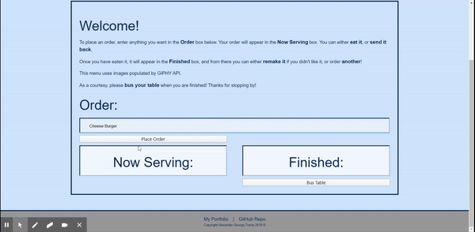
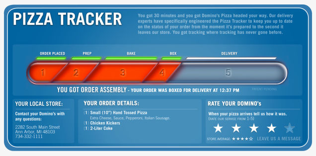

# Employee Tracker

This is an app enables a user to virtually order very custom burgers. The user's choice is then served up in the form of a `.gif` file inside a bun.

Check out the repo [here](https://github.com/agtravis/burger), and see the app in operation [here](https://agtravis-burger.herokuapp.com/).

This app runs in the browser - see [Setup](#setup) below for instructions on how to use.

## Table of contents

- [General info](#general-info)
- [Screenshots](#screenshots)
- [Technologies](#technologies)
- [Code Examples](#code-examples)
- [Setup](#setup)
- [Features](#features)
- [Status](#status)
- [Contact](#contact)

## General info

This app uses a custom built ORM (Object Relation Mapping) library to somewhat abstract SQL queries. The app has an overall burger restaurant theme, however the user can enter anything they want, so can really have fun with the architecture. The 'burgers' are simply represented by a `.gif` file sourced from `GIPHY API` based on the user's input. The app then has various _restaurant themed_ functions to EAT, SEND BACK, and ORDER ANOTHER burger, or when they are done they can BUS TABLE, to clean up - all these functions perform one of the `CRUD` operations (in SQL's case these are `INSERT`, `SELECT`, `UPDATE`, and `DELETE`). In the [Technologies](#technologies) section I will go into more detail for the "journey" of a burger.

## Screenshots

See a quick demo of the app [here](https://drive.google.com/file/d/1lyWQyYamQnNS7SDfIV9sS6xCXK7tkRwX/view) or watch the Gif below:

## Technologies

Here are the package.json dependencies:

    "dependencies": {
        "express": "^4.17.1",
        "express-handlebars": "^3.1.0",
        "mysql": "^2.18.1"
    }

This package was written in JavaScript using Node.js, and uses `MySQL` to interact with the database. If the GitHub repo is forked, in order to edit the code the user can run `npm i` to install this dependency. `Express` is the module used to create a server, and `express-handlebars` is a way to dynamically serve HTML or sections of HTML to the client.

The app is hosted via `Heroku` in order to facilitate the necessity of having a database.

## Code Examples

Let's chart the passage of a custom user input (a burger) as a way to understand the code.

Before the user inputs anything, the page will load whatever the database has stored already, and since their are no unique users, this database is changed for anyone who views the page.

If we look in the `burger_controllers.js`, we can see our routes. The when the home route (`'/'`) is called, the burger model is called, and uses the custom method `.selectAll()` to obtain all the information about the burger stored in the database. it is only once this call has been completed (via a callback function) that a few lines of code run on each of the retrieved objects, in order to extract a word describing the burger out, and pass as a new property of the burger object. This new property could simply be generated on creation, and actually stored as part of the database, but that would require more permanent storage information, so we are looking at a trade-off between performance on the front end vs storage. For this kind of app, extrapolated out and with the nature of the user being able to choose ANYTHING, I think it is best to generate the description word at this point:

    router.get('/', (req, res) => {
        burger.selectAll(async function(data) {
            const allBurgersObj = {
                burgers: data
            };
            const skipWordsArr = ['double', 'triple', 'extra', 'large', 'big', 'the'];
            for (const burger of allBurgersObj.burgers) {
                const asArr = burger.burger_name.split(' ');
                let firstWord = asArr[0];
                if (skipWordsArr.includes(firstWord.toLowerCase())) {
                    firstWord = asArr[1];
                }
                burger.firstWord = firstWord.toLowerCase();
            }
            res.render('index', allBurgersObj);
        });
    });

The description word (here as the property 'firstWord') will be appended to an API query, and therefore be able to dynamically generate a response based on the burger. While Giphy won't always make sense for the purposes of a burger filling, I can somewhat control this by telling my code that if the first word is equal to something that is not a food (for example, many burger names start with _'Double'_), it will skip over to the next word. This is just demonstrative, and if I really wanted to implement this completely, the array could be a lot larger, there could be a recursive helper function, or - perhaps more realistically - the user would not be able to choose anything from their imagination, but be constricted by a _menu_!

With the object completed, it is now passed to the response using the `.render()` method. This is because we are using `Handlebars` to dynamically insert our burgers.

Now we can come into our `Handlebars` files which have been partitioned to make the HTML more flexible. This page doesn't really do too much, so It could all be done easily without partions, however I have opted to include this feature for demonstration purposes. Each 'status' div looks as follows:

    

        <h3>Finished:</h3>
        <ul>
            {{#each burgers}}
            {{#if devoured}}
            {{> burgers/burger-block devoured=true}}
            {{/if}}
            {{/each}}
        </ul>
    

The `'id="serving"'` div looks the same except `devoured=false` and it uses `{{#unless...}}` instead of `{{/if}}`. Within the partition file is simply one `<li>` item with some code that dictates which function buttons are displayed (based on the devoured boolean).

Now let's take that journey through the code, using the `'POST'` API request. A user can create a new burger in two ways - either by entering a new burger in the input field, or by clicking the button that orders up another. The only difference with the two requests is the former gets the name via `name: $('#burg').val().trim()` and the latter `name: $(this).data('name')`, but ultimately the same object key is being passed. This takes us back to the burger_controllers.js file, for the routing:

    router.post('/api/burgers/', (req, res) => {
        burger.insertOne('burger_name', req.body.name, function(result) {
            res.json({ id: result.insertId });
        });
    });

As before, this calls the burger.js model, but this time the custom method used is `.insertOne()`. This takes three arguments, the SQL column name, the data we are getting from the `req` object, and a callback function, which in this case is sending back a JSON object and updating the ID of that object. This now passes to where that model is defining that custom method:

    insertOne: function(colName, val, cb) {
        orm.insertOne('burgers', colName, val, function(res) {
            cb(res);
        });

This is from the burger model. As you can see, in turn, it is being passed the column name, defined as a string; the value to be inserted, `req.body.name`, and that callback function. It calls the `orm.insertOne()` method, passing all of the arguments as before, but now adding the table name as the first argument. This is separated at this level because up one level, the same function could be used again on a different table (if there was one), but this model is specifically for the burger table, so it makes sense to hard code the table name as a string here. Next, in the ORM:

    insertOne: function(table, colName, val, cb) {
        const query = `INSERT INTO ?? (??) VALUES (?);`;
        connection.query(query, [table, colName, val], (err, res) => {
            if (err) throw err;
            cb(res);
        });
    },

We can see the method in full 'SQL' flow. The query is hard-coded, and error handled. Finally the callback function is called on the response. Once this is complete, back in the original `AJAX` request, the `location.reload()`s and the new information is displayed.

This general path can be followed for all the `CRUD` actions.

## Setup

This app runs in the browser. Here are the instructions from the homepage:

_To place an order, enter anything you want in the Order box below. Your order will appear in the Now Serving box. You can either eat it, or send it back._

_Once you have eaten it, it will appear in the Finished box, and from there you can either remake it if you didn't like it, or order another!_

_As a courtesy, please bus your table when you are finished! Thanks for stopping by!_

## Features

This app tries to reflect the very real possible usage of an ordering system in a restaurant. In that case, the order would be taken and input by a cashier, and the order would be placed in a 'preparation' phase. Next, when complete, it would move into a 'distribution' phase, where it would be delivered to the customer, and this can be continued or broken down into smaller steps. A very real example of this would be the Dominos Pizza Order Tracker feature:

.

It is worth mentioning that in my opinion this tracker is probably run using a combination of timers and event triggers to transition between stages, but in essence it is the same thing.

## Status & Future Developement

This app is currently slightly above MVP as far as achieving my personal objective. Adding the interaction with Giphy was fun, but I could probably streamline that, and also make more effort with the styling, however the app _is_ responsive, and could be considered **mobile-first** even though it wasn't planned that way.

As mentioned before, this would not take much to be implemented in a real restaurant setting - outside of implementing a real customer/financial system of course.

## Contact

Created by [@agtravis](https://agtravis.github.io/)
View in my [portfolio](https://agtravis.github.io/portfolio.html)
